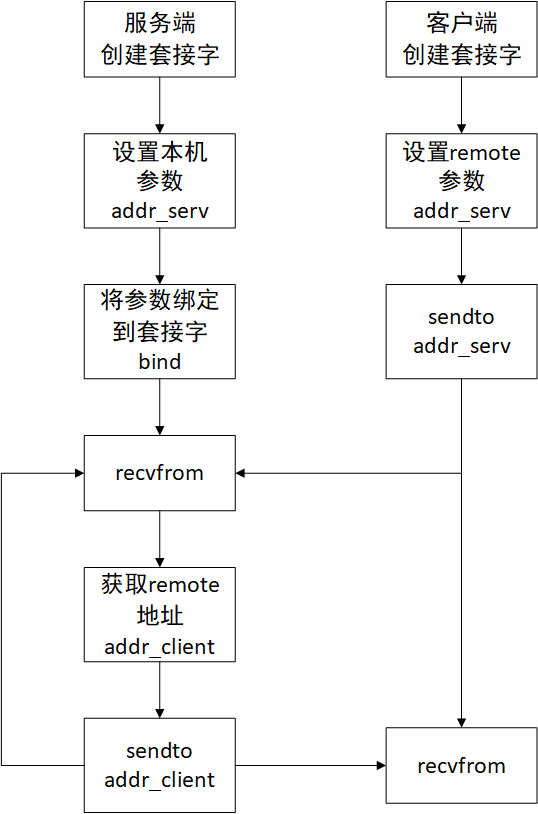

# socket 基本通信流程
本节我们将会编写 UDP 的客户端和服务器，熟悉 socket 的基本通信流程。

## Question
1. 为什么 client 没有 bind 也可以接收到报文

    bind 本质上是显示设置 socket 的参数（监听地址，监听端口等），如果不显示指定，系统就会给你安排一个随机值，客户端的socket就在这个上随机的端口上监听请求

2. server 必须通过 bind 显式设置 socket 参数吗

    对，如果不显式设置的话，就会在随机的端口上监听，客户端无法知道这个随机的端口的值

    